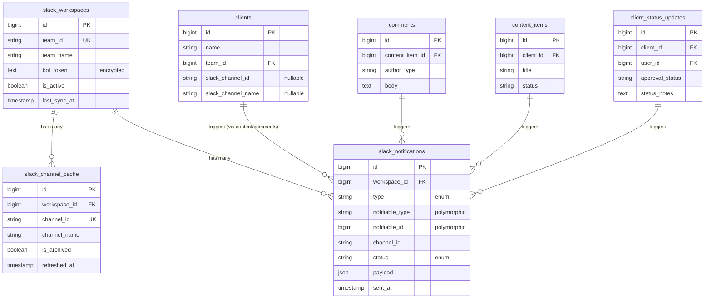

# Data Model: Slack Integration

**Feature**: Slack Integration for Client Notifications
**Date**: 2025-10-10
**Status**: Design Complete

## Overview

This document defines the database schema, entity relationships, and data structures for the Slack integration feature in Joy.

## Database Schema

### New Tables

#### 1. `slack_workspaces`

Stores the Slack workspace connection configuration. Single workspace support (one active record).

```sql
CREATE TABLE slack_workspaces (
    id BIGINT UNSIGNED AUTO_INCREMENT PRIMARY KEY,
    team_id VARCHAR(255) NOT NULL UNIQUE COMMENT 'Slack team/workspace ID',
    team_name VARCHAR(255) NOT NULL COMMENT 'Slack workspace name',
    bot_token TEXT NOT NULL COMMENT 'Encrypted bot OAuth token',
    access_token TEXT NULL COMMENT 'Encrypted user access token (if using OAuth)',
    scopes TEXT NULL COMMENT 'JSON array of granted OAuth scopes',
    bot_user_id VARCHAR(255) NULL COMMENT 'Slack bot user ID',
    is_active BOOLEAN DEFAULT TRUE COMMENT 'Is this workspace connection active',
    last_sync_at TIMESTAMP NULL COMMENT 'Last time channels were synced',
    last_error TEXT NULL COMMENT 'Last connection error message',
    metadata JSON NULL COMMENT 'Additional workspace metadata',
    created_at TIMESTAMP DEFAULT CURRENT_TIMESTAMP,
    updated_at TIMESTAMP DEFAULT CURRENT_TIMESTAMP ON UPDATE CURRENT_TIMESTAMP,

    INDEX idx_team_id (team_id),
    INDEX idx_is_active (is_active)
) ENGINE=InnoDB DEFAULT CHARSET=utf8mb4 COLLATE=utf8mb4_unicode_ci;
```

**Laravel Migration**:
```php
Schema::create('slack_workspaces', function (Blueprint $table) {
    $table->id();
    $table->string('team_id')->unique()->comment('Slack team/workspace ID');
    $table->string('team_name')->comment('Slack workspace name');
    $table->text('bot_token')->comment('Encrypted bot OAuth token');
    $table->text('access_token')->nullable()->comment('Encrypted user access token');
    $table->text('scopes')->nullable()->comment('JSON array of granted OAuth scopes');
    $table->string('bot_user_id')->nullable()->comment('Slack bot user ID');
    $table->boolean('is_active')->default(true)->comment('Is this workspace connection active');
    $table->timestamp('last_sync_at')->nullable()->comment('Last time channels were synced');
    $table->text('last_error')->nullable()->comment('Last connection error message');
    $table->json('metadata')->nullable()->comment('Additional workspace metadata');
    $table->timestamps();

    $table->index('team_id');
    $table->index('is_active');
});
```

**Fields**:
- `bot_token`: Encrypted using Laravel's `encrypted` cast
- `access_token`: Optional, encrypted OAuth token if using full OAuth flow
- `scopes`: JSON array like `["channels:read", "chat:write"]`
- `metadata`: Store additional info like installation date, installer user, etc.

---

#### 2. `slack_notifications`

Audit log of all Slack notification attempts (success and failure).

```sql
CREATE TABLE slack_notifications (
    id BIGINT UNSIGNED AUTO_INCREMENT PRIMARY KEY,
    workspace_id BIGINT UNSIGNED NOT NULL COMMENT 'Foreign key to slack_workspaces',
    type ENUM('client_comment', 'content_approved', 'content_rejected', 'statusfaction_submitted', 'statusfaction_approved') NOT NULL COMMENT 'Type of notification',
    notifiable_type VARCHAR(255) NOT NULL COMMENT 'Polymorphic type (Comment, ContentItem, ClientStatusUpdate)',
    notifiable_id BIGINT UNSIGNED NOT NULL COMMENT 'Polymorphic ID',
    channel_id VARCHAR(255) NOT NULL COMMENT 'Slack channel ID where notification was sent',
    channel_name VARCHAR(255) NULL COMMENT 'Slack channel name (cached for display)',
    status ENUM('pending', 'sent', 'failed') DEFAULT 'pending' COMMENT 'Delivery status',
    payload JSON NULL COMMENT 'Slack message payload (blocks)',
    response JSON NULL COMMENT 'Slack API response',
    error_message TEXT NULL COMMENT 'Error message if failed',
    sent_at TIMESTAMP NULL COMMENT 'When notification was successfully sent',
    created_at TIMESTAMP DEFAULT CURRENT_TIMESTAMP,
    updated_at TIMESTAMP DEFAULT CURRENT_TIMESTAMP ON UPDATE CURRENT_TIMESTAMP,

    FOREIGN KEY (workspace_id) REFERENCES slack_workspaces(id) ON DELETE CASCADE,
    INDEX idx_notifiable (notifiable_type, notifiable_id),
    INDEX idx_status (status),
    INDEX idx_type (type),
    INDEX idx_channel (channel_id),
    INDEX idx_created_at (created_at)
) ENGINE=InnoDB DEFAULT CHARSET=utf8mb4 COLLATE=utf8mb4_unicode_ci;
```

**Laravel Migration**:
```php
Schema::create('slack_notifications', function (Blueprint $table) {
    $table->id();
    $table->foreignId('workspace_id')->constrained('slack_workspaces')->onDelete('cascade');
    $table->enum('type', [
        'client_comment',
        'content_approved',
        'content_rejected',
        'statusfaction_submitted',
        'statusfaction_approved'
    ])->comment('Type of notification');
    $table->string('notifiable_type')->comment('Polymorphic type');
    $table->unsignedBigInteger('notifiable_id')->comment('Polymorphic ID');
    $table->string('channel_id')->comment('Slack channel ID');
    $table->string('channel_name')->nullable()->comment('Slack channel name (cached)');
    $table->enum('status', ['pending', 'sent', 'failed'])->default('pending');
    $table->json('payload')->nullable()->comment('Slack message payload');
    $table->json('response')->nullable()->comment('Slack API response');
    $table->text('error_message')->nullable();
    $table->timestamp('sent_at')->nullable();
    $table->timestamps();

    $table->index(['notifiable_type', 'notifiable_id']);
    $table->index('status');
    $table->index('type');
    $table->index('channel_id');
    $table->index('created_at');
});
```

**Polymorphic Relationship**:
- `notifiable_type` can be: `App\Models\Comment`, `App\Models\ContentItem`, `App\Models\ClientStatusUpdate`
- `notifiable_id` references the ID of the source entity

---

#### 3. `slack_channel_cache` (Optional)

Cache of Slack channels to avoid repeated API calls. Optional optimization.

```sql
CREATE TABLE slack_channel_cache (
    id BIGINT UNSIGNED AUTO_INCREMENT PRIMARY KEY,
    workspace_id BIGINT UNSIGNED NOT NULL COMMENT 'Foreign key to slack_workspaces',
    channel_id VARCHAR(255) NOT NULL UNIQUE COMMENT 'Slack channel ID',
    channel_name VARCHAR(255) NOT NULL COMMENT 'Slack channel name',
    is_private BOOLEAN DEFAULT FALSE COMMENT 'Is this a private channel',
    is_archived BOOLEAN DEFAULT FALSE COMMENT 'Is this channel archived',
    member_count INT UNSIGNED NULL COMMENT 'Number of members in channel',
    purpose TEXT NULL COMMENT 'Channel purpose/description',
    refreshed_at TIMESTAMP NOT NULL COMMENT 'When this cache entry was last refreshed',
    created_at TIMESTAMP DEFAULT CURRENT_TIMESTAMP,
    updated_at TIMESTAMP DEFAULT CURRENT_TIMESTAMP ON UPDATE CURRENT_TIMESTAMP,

    FOREIGN KEY (workspace_id) REFERENCES slack_workspaces(id) ON DELETE CASCADE,
    INDEX idx_workspace (workspace_id),
    INDEX idx_channel_name (channel_name),
    INDEX idx_is_archived (is_archived),
    INDEX idx_refreshed_at (refreshed_at)
) ENGINE=InnoDB DEFAULT CHARSET=utf8mb4 COLLATE=utf8mb4_unicode_ci;
```

**Laravel Migration**:
```php
Schema::create('slack_channel_cache', function (Blueprint $table) {
    $table->id();
    $table->foreignId('workspace_id')->constrained('slack_workspaces')->onDelete('cascade');
    $table->string('channel_id')->unique()->comment('Slack channel ID');
    $table->string('channel_name')->comment('Slack channel name');
    $table->boolean('is_private')->default(false)->comment('Is this a private channel');
    $table->boolean('is_archived')->default(false)->comment('Is this channel archived');
    $table->unsignedInteger('member_count')->nullable()->comment('Number of members');
    $table->text('purpose')->nullable()->comment('Channel purpose/description');
    $table->timestamp('refreshed_at')->comment('When cache was last refreshed');
    $table->timestamps();

    $table->index('workspace_id');
    $table->index('channel_name');
    $table->index('is_archived');
    $table->index('refreshed_at');
});
```

**Cache Strategy**:
- Refresh every 24 hours or on manual trigger
- Exclude archived channels from display
- Used to populate dropdown in Filament admin

---

### Modified Tables

#### 1. `clients` - Add Slack Channel Association

```sql
ALTER TABLE clients
ADD COLUMN slack_channel_id VARCHAR(255) NULL COMMENT 'Associated Slack channel ID' AFTER trello_list_id,
ADD COLUMN slack_channel_name VARCHAR(255) NULL COMMENT 'Associated Slack channel name (cached)' AFTER slack_channel_id,
ADD INDEX idx_slack_channel (slack_channel_id);
```

**Laravel Migration**:
```php
Schema::table('clients', function (Blueprint $table) {
    $table->string('slack_channel_id')->nullable()->comment('Associated Slack channel ID')->after('trello_list_id');
    $table->string('slack_channel_name')->nullable()->comment('Associated Slack channel name (cached)')->after('slack_channel_id');

    $table->index('slack_channel_id');
});
```

**Rationale**:
- Store both ID (for API calls) and name (for display)
- Nullable to allow clients without Slack integration
- Indexed for efficient lookups when sending notifications

---

## Entity Relationships

### ER Diagram (Mermaid)



### Eloquent Relationships

#### SlackWorkspace Model

```php
namespace App\Models;

class SlackWorkspace extends Model
{
    protected $fillable = [
        'team_id', 'team_name', 'bot_token', 'access_token',
        'scopes', 'bot_user_id', 'is_active', 'last_sync_at',
        'last_error', 'metadata'
    ];

    protected $casts = [
        'bot_token' => 'encrypted',
        'access_token' => 'encrypted',
        'scopes' => 'array',
        'metadata' => 'array',
        'is_active' => 'boolean',
        'last_sync_at' => 'datetime',
    ];

    // Relationships
    public function channels(): HasMany
    {
        return $this->hasMany(SlackChannelCache::class, 'workspace_id');
    }

    public function notifications(): HasMany
    {
        return $this->hasMany(SlackNotification::class, 'workspace_id');
    }

    // Helper methods
    public function isActive(): bool
    {
        return $this->is_active;
    }

    public static function getDefault(): ?self
    {
        return self::where('is_active', true)->first();
    }
}
```

#### SlackNotification Model

```php
namespace App\Models;

class SlackNotification extends Model
{
    protected $fillable = [
        'workspace_id', 'type', 'notifiable_type', 'notifiable_id',
        'channel_id', 'channel_name', 'status', 'payload',
        'response', 'error_message', 'sent_at'
    ];

    protected $casts = [
        'payload' => 'array',
        'response' => 'array',
        'sent_at' => 'datetime',
    ];

    // Relationships
    public function workspace(): BelongsTo
    {
        return $this->belongsTo(SlackWorkspace::class, 'workspace_id');
    }

    public function notifiable(): MorphTo
    {
        return $this->morphTo();
    }

    // Scopes
    public function scopeFailed($query)
    {
        return $query->where('status', 'failed');
    }

    public function scopeSent($query)
    {
        return $query->where('status', 'sent');
    }

    public function scopeForChannel($query, string $channelId)
    {
        return $query->where('channel_id', $channelId);
    }

    // Helper methods
    public function markAsSent(array $response): void
    {
        $this->update([
            'status' => 'sent',
            'response' => $response,
            'sent_at' => now(),
        ]);
    }

    public function markAsFailed(string $error): void
    {
        $this->update([
            'status' => 'failed',
            'error_message' => $error,
        ]);
    }
}
```

#### SlackChannelCache Model

```php
namespace App\Models;

class SlackChannelCache extends Model
{
    protected $fillable = [
        'workspace_id', 'channel_id', 'channel_name',
        'is_private', 'is_archived', 'member_count',
        'purpose', 'refreshed_at'
    ];

    protected $casts = [
        'is_private' => 'boolean',
        'is_archived' => 'boolean',
        'refreshed_at' => 'datetime',
    ];

    // Relationships
    public function workspace(): BelongsTo
    {
        return $this->belongsTo(SlackWorkspace::class, 'workspace_id');
    }

    // Scopes
    public function scopeActive($query)
    {
        return $query->where('is_archived', false);
    }

    public function scopePublic($query)
    {
        return $query->where('is_private', false);
    }

    public function scopeStale($query, int $hours = 24)
    {
        return $query->where('refreshed_at', '<', now()->subHours($hours));
    }

    // Helper methods
    public function isStale(int $hours = 24): bool
    {
        return $this->refreshed_at->diffInHours(now()) > $hours;
    }
}
```

#### Client Model (Updated)

```php
namespace App\Models;

class Client extends Model
{
    protected $fillable = [
        'name', 'description', 'team_id',
        'trello_board_id', 'trello_list_id',
        'slack_channel_id', 'slack_channel_name', // NEW
    ];

    // Existing relationships...

    // NEW: Slack integration helper
    public function hasSlackIntegration(): bool
    {
        return !empty($this->slack_channel_id);
    }

    // NEW: Get Slack notifications for this client
    public function slackNotifications(): HasManyThrough
    {
        // This is conceptual - actual implementation may vary
        // based on how we track client relationship to notifications
        return $this->hasManyThrough(
            SlackNotification::class,
            Comment::class, // or ContentItem, or ClientStatusUpdate
            'client_id',
            'notifiable_id'
        )->where('notifiable_type', Comment::class);
    }
}
```

---

## Data Flow

### Notification Trigger Flow

```
1. User Action (e.g., client adds comment)
   ↓
2. Model Event (Comment::created)
   ↓
3. Check if client has Slack integration
   ↓
4. Dispatch Job (SendClientCommentNotification)
   ↓
5. Job executes → Call SlackService
   ↓
6. SlackService posts message to Slack API
   ↓
7. Create SlackNotification record (audit)
   ↓
8. Update record status (sent/failed)
```

### Channel Selection Flow (Admin UI)

```
1. Admin opens Client form in Filament
   ↓
2. Slack channel dropdown loads
   ↓
3. Check SlackChannelCache (if fresh, use cache)
   ↓
4. If stale, fetch from Slack API
   ↓
5. Update cache with fresh data
   ↓
6. Populate dropdown with active, public channels
   ↓
7. Admin selects channel
   ↓
8. Save client with slack_channel_id and slack_channel_name
```

---

## Indexing Strategy

### Performance Considerations

1. **slack_notifications.notifiable_type + notifiable_id**: Composite index for polymorphic lookups
2. **slack_notifications.created_at**: For time-based queries and reporting
3. **slack_notifications.status**: For filtering pending/failed notifications
4. **slack_channel_cache.refreshed_at**: For identifying stale cache entries
5. **clients.slack_channel_id**: For efficient client lookups by channel

---

## Data Validation Rules

### SlackWorkspace

- `team_id`: required, unique, max 255 chars
- `team_name`: required, max 255 chars
- `bot_token`: required, encrypted, will be validated against Slack API
- `is_active`: boolean, default true

### SlackNotification

- `type`: enum, must be one of defined notification types
- `notifiable_type`: required, must be valid model class
- `notifiable_id`: required, must exist in referenced table
- `channel_id`: required, max 255 chars
- `status`: enum (pending, sent, failed)

### SlackChannelCache

- `channel_id`: required, unique, max 255 chars
- `channel_name`: required, max 255 chars
- `refreshed_at`: required, must be valid timestamp

### Client (Slack Fields)

- `slack_channel_id`: nullable, max 255 chars, validated against cache
- `slack_channel_name`: nullable, max 255 chars

---

## Sample Data

### SlackWorkspace Example

```json
{
  "id": 1,
  "team_id": "T0123456789",
  "team_name": "MajorMajor Digital Marketing",
  "bot_token": "[ENCRYPTED]",
  "scopes": ["channels:read", "chat:write", "chat:write.public"],
  "bot_user_id": "U0123456789",
  "is_active": true,
  "last_sync_at": "2025-10-10T10:30:00Z",
  "metadata": {
    "installed_by": "admin@majormajor.com",
    "installation_date": "2025-10-10"
  }
}
```

### SlackNotification Example

```json
{
  "id": 42,
  "workspace_id": 1,
  "type": "client_comment",
  "notifiable_type": "App\\Models\\Comment",
  "notifiable_id": 15,
  "channel_id": "C0123456789",
  "channel_name": "#acme-corp",
  "status": "sent",
  "payload": {
    "blocks": [
      {
        "type": "section",
        "text": {
          "type": "mrkdwn",
          "text": "*New Comment from Client*\nJohn Doe commented on 'Fall Campaign Post'"
        }
      }
    ]
  },
  "response": {
    "ok": true,
    "ts": "1696965600.123456"
  },
  "sent_at": "2025-10-10T14:23:45Z"
}
```

### Client with Slack Integration

```json
{
  "id": 7,
  "name": "Acme Corporation",
  "team_id": 3,
  "slack_channel_id": "C0123456789",
  "slack_channel_name": "#acme-corp",
  "created_at": "2025-09-15T10:00:00Z"
}
```

---

## Migration Order

To avoid foreign key constraint issues, migrations must be run in this order:

1. `create_slack_workspaces_table.php`
2. `create_slack_channel_cache_table.php`
3. `create_slack_notifications_table.php`
4. `add_slack_fields_to_clients_table.php`

---

## Summary

This data model provides:

- **Workspace Management**: Single Slack workspace connection with encrypted credentials
- **Audit Trail**: Complete logging of all notification attempts
- **Performance Optimization**: Optional channel caching to reduce API calls
- **Client Association**: Direct mapping of clients to Slack channels
- **Polymorphic Tracking**: Flexible notification source tracking
- **Scalability**: Indexed queries for efficient reporting and lookups

All tables follow Laravel conventions and support the feature requirements defined in `spec.md`.
